# Undergraduate Honors Thesis Models: In-Pipe and Cap Environmental Passive Samplers

**Manuscript Title:** Rapid Detection of High-Risk Pathogens: Development of In-Pipe Environmental Passive Samplers  
**Author:** Felix Leahey  

---

## 🎉 Free to Download!

All models are available for free download as **.F3z** (for Fusion 360) and **STL** for scientific development and further research. Use them, iterate on them, and build something better.

Currently, only marks 7 and 10, the main in-pipe and cap sampler are availible. I will soon update with the rest of the models and include .STEP files as well. 

---

## Overview

This repository documents the full design development of passive wastewater sampler models developed over a two-year period starting January 2024. All models are designed to house **0.45μm mixed cellulose ester (MCE) filter discs** for pathogenic DNA/RNA capture from wastewater.

The development spans two project goals:
- **Mark 1**:Open channel passive sampling as an alternative to conventional auto-samplers
- **Marks 2–10**:In-building, in-pipe sampling for floor-by-floor or wing-by-wing sampling specificity in high-risk facilities

A variety of model architectures were explored to address real-world pipe access constraints, culminating in the TPU rubber ring-integrated **Mark 7** and the T-intersection cleanout lid models **Marks 8 through 10**.

---

## Design Generations

### Mark 1
The base model, conceived January 2024. The filter is placed between two slotted plates and slid into the confines of the "U"-shaped body. The lid can only be removed in the direction opposite to running water and solids, ensuring it cannot be dislodged by flow. This safety principle was carried forward into all subsequent generations.

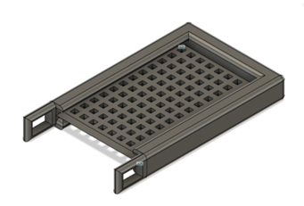
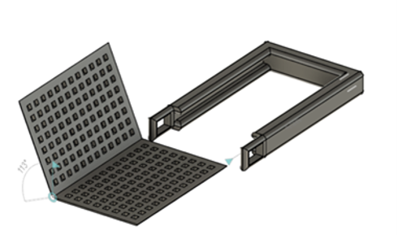

---

### Mark 2
With the inception of the in-pipe sampling goal, Mark 2 rounded out the flat and boxy Mark 1 frame with a thin, easy-to-slide lid. However, the internal space was still too large and did not adequately restrain the filter paper, allowing movement inside the sampler body.

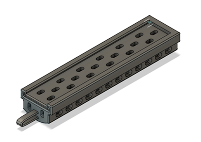
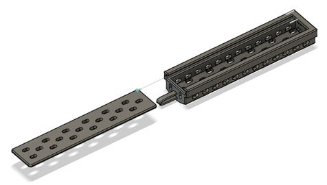

---

### Mark 3
Mark 3 began approaching the in-pipe design goal in earnest. The model was slimmed and rounded for fitting inside a circular pipe while maintaining the directional lid retention principle from Mark 1.

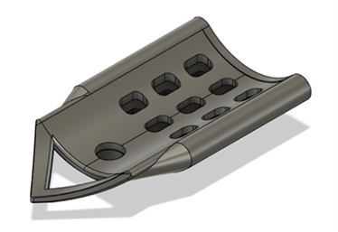
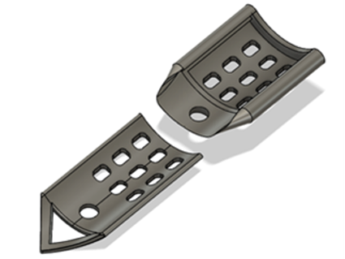

---

### Mark 4
Mark 4 improved on Mark 3 by eliminating the internal cavity so the filter is sandwiched directly between body and lid, as in Mark 1. The slide retention wall height was reduced to facilitate easier lid placement and removal. The two separated handles at the top were identified as a structural weakness, being prone to snapping under stress.

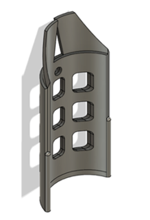
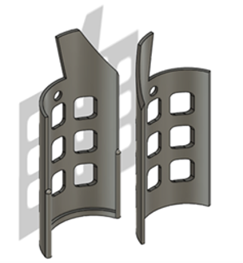

---

### Mark 5
A divergent design option. The sliding lid mechanism combined with the tight filter fit caused filter paper tearing during loading. Mark 5 explored converting to a **snapping lid**, circumventing the risk of dragging and damaging the filter membrane during insertion.

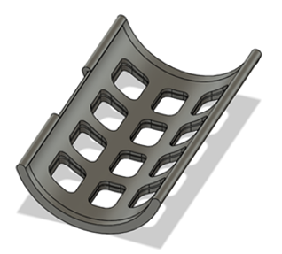
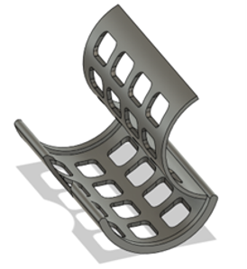

---

### Mark 6
Mark 6 refined the snap-lid design of Mark 5. Wall thickness was increased by several millimeters for resilience, and small plastic orientation rings were added to keep the sampler correctly positioned inside the pipe and prevent it from flipping. This generation also introduced the **filter membrane cavity** — an intentional recess that prevents the lid from dragging across and tearing the filter during loading or unloading.

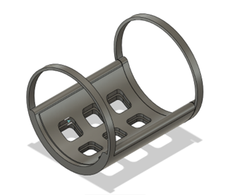
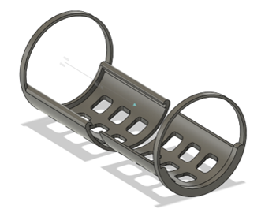
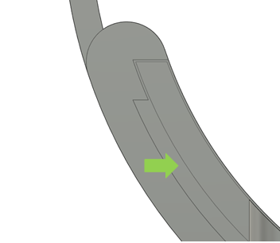
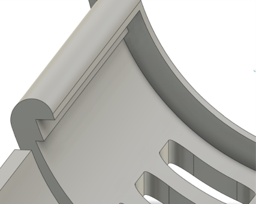

---

### Mark 7
Mark 7 integrated separately printed **TPU rubber rings**, providing the flexibility to navigate imperfect pipe entry conditions — most notably a sharp 90-degree insertion angle. This model was the **first to be fully parameterized**, allowing it to be adapted to a range of pipe diameters faster and more easily than any prior generation.

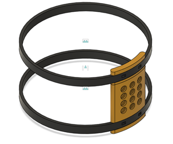
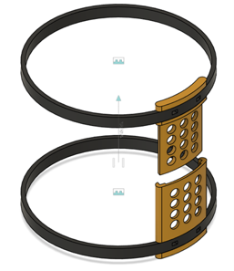

---

### Mark 8
The first **"cap" sampler**, designed to affix to a T-intersection plumbing cleanout cap. The sampler body mounts on threaded bolts with washers and nuts, and printed spacers position it at the correct depth to sit flush with the intersecting pipe at the T-junction.

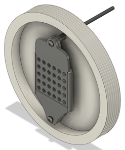
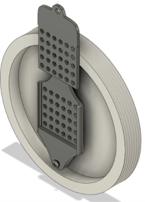

---

### Mark 9
A full redesign of the cap sampler format for **4" diameter caps**, in contrast to Mark 8's 6" diameter. This was necessitated after a prospective test hospital confirmed their pipe access points were 4" upon arrival — contrary to the originally communicated 6".

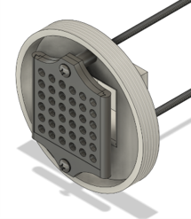
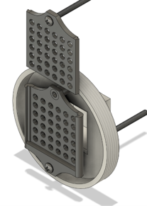

---

### Mark 9 (B)
An iteration on Mark 9 featuring elongated screw holes in the linear direction, allowing a longer spacer on one end to tilt the sampler at an angle once installed. The intention was to have the sampler protrude into the pipe flow to maximize wastewater exposure. Quickly succeeded by Mark 10.

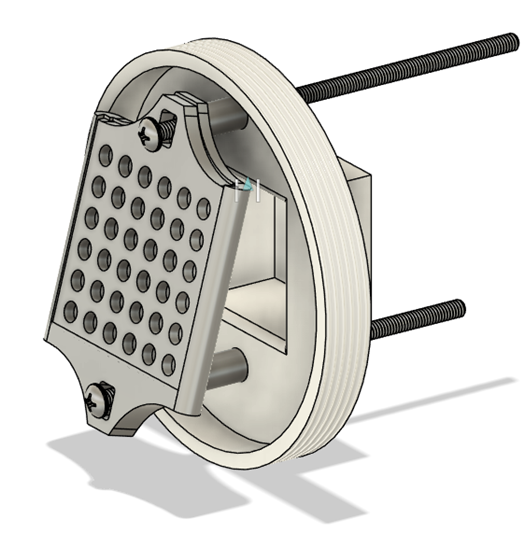

---

### Mark 10
The current most refined cap sampler. Mark 10 introduces a **curvature on the sampler body face** that matches the profile of the intersecting pipe as closely as possible, minimizing solids aggregation on the sampler surface. The model is designed to sit flush within the T-intersection cleanout when fully installed.

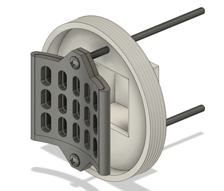
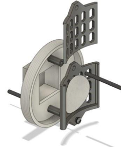
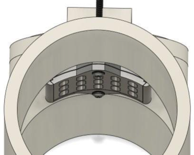
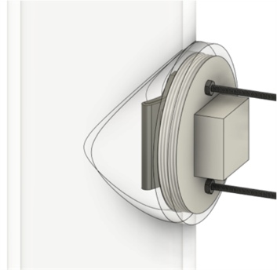

---

## Citation

If you use these models in your research, please cite:

> Leahey, F. (2026). *Rapid Detection of High-Risk Pathogens: Development of In-Pipe Environmental Passive Samplers* [Undergraduate Honors Thesis]. Oregon State University.

---

## Contact

For questions about the models or methodology, feel free to open an issue on this repository.
